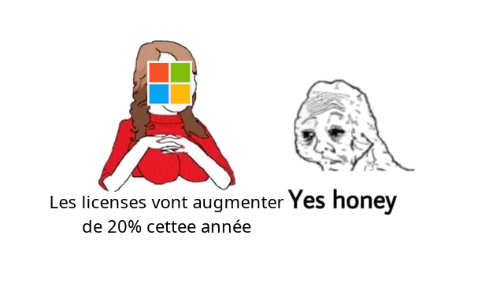
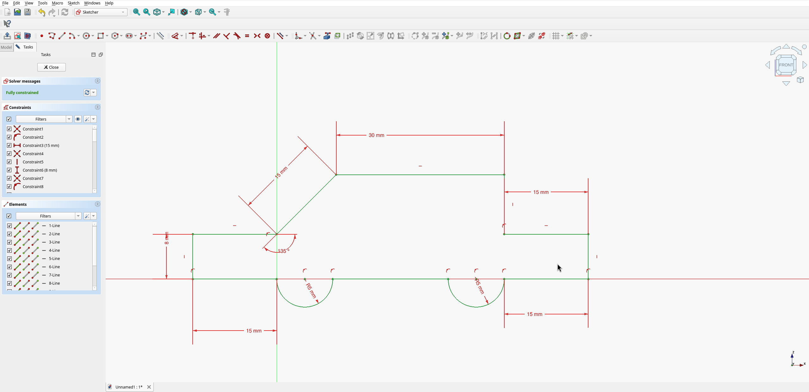
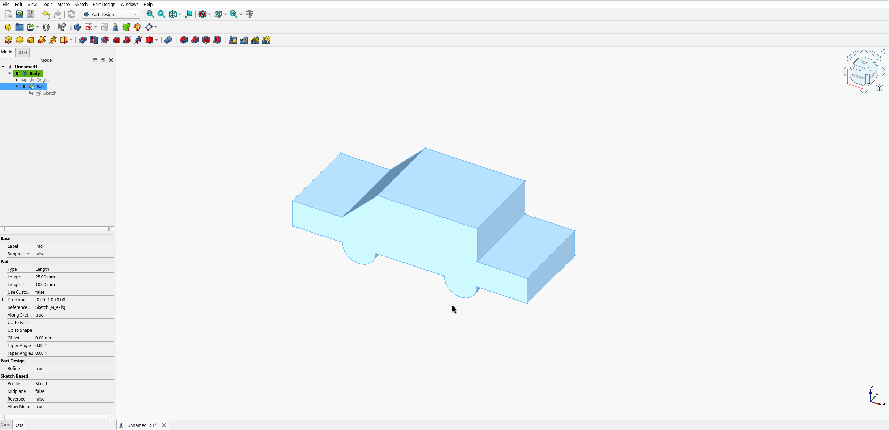
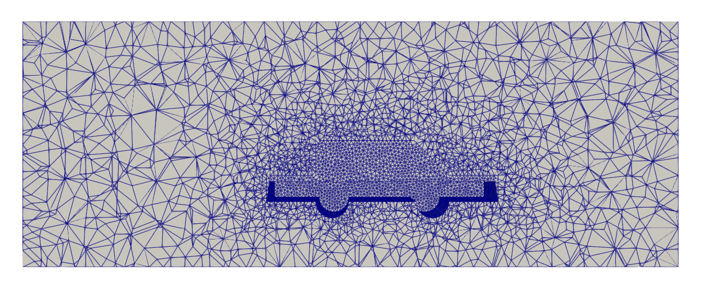
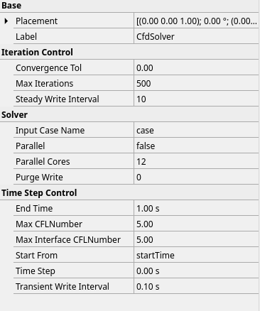
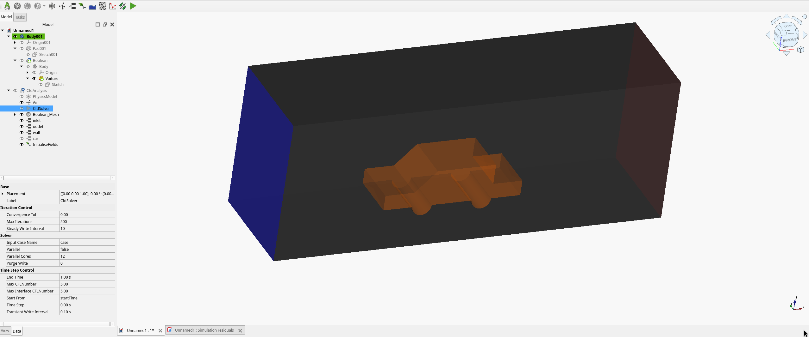
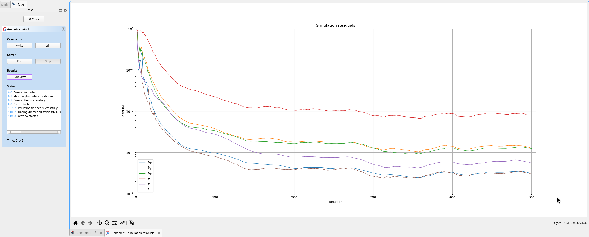

<h1 class="r-fit-text">Simulation numérique et logiciel libre</h2>

Louis Gombert - 15/11/2025 - Campus du Libre, INSA Lyon

---
### $whoami

- Télécom INSA Lyon '23
- Ingénieur R&D @ Kitware
- Associatif: SIA, Cod'INSA, F8KLY...

---
### Simulation numérique, pour quoi ?

Modèle 1:1000 de la baie de San Francisco, 1957

Credits: Wikimedia Commons

Note: https://www.youtube.com/watch?v=i70wkxmumAw

***

### Simulation numérique, pour quoi ?

Soufflerie à Magny-Cours, 250kW

Credits: Aero concept Engineering

Note: https://www.aero-ce.com/nos-moyens

---

### En somme

- **Modélisation** basée sur des **phénomènes physiques**
- Itérations plus rapides pour les ingénieurs
- **Réduction des coûts** de développement et du risque

---

### Les étapes d'une simulation

<pre>
    %%{init: {'theme': 'light', 'themeVariables': { 'darkMode': false }}}%%
    flowchart LR
    A[CA0] --> B[Prétraitement]
    B --> C[Simulateur]
    C --> D[Post-traitement]
</pre>

***

### Les étapes d'une simulation

<pre>
    %%{init: {'theme': 'light', 'themeVariables': { 'darkMode': false }}}%%
    flowchart LR
    A[CAO] -- représentation paramétrique --> B[Prétraitement]
    B -- Maillage adapté, conditions initiales... --> C[Simulateur]
    C -- Nouvelle géométrie, champs scalaires --> D[Post-traitement]
</pre>

---

### Dans l'industrie (et les écoles)

- Ecosystèmes propriétaires "tout-en-un"
- Ansys, Autodesk, STAR-CCM+ (Siemens), Simulia (Dassault), COMSOL...

---

---

### Pourquoi l'open source?

- Accessibilité
- Interopérabilité
- Extensibilité
- Maîtrise des coûts

---

### Tour d'horizon des logiciels
### open source

---

### CAD: FreeCAD

- Modélisation paramétrique de pièces
- Basé sur les kernels OpenCASCADE
- v1.0.0 sortie il y a 1 an

License: LGPL

***

Contraintes sur un schéma 2D

***

Extrusion de la pièce
---

### Pre-processing: GMSH

- Création de maillage raffiné pour la simulation
- Pont depuis FreeCAD
- Module IHM

License: GPLv2

***

Affinage du maillage volumique à proximité de la voiture

---

### Solveurs

- Beaucoup de diversité et de méthodes!
- CFD: OpenFOAM (GPL), code_saturne (GPL)
- Autres FEM: code_aster (GPL), OpenRadioss (AGPL)
- Nouvelle génération: FEniCS (LGPL)

***

Définition des méta-données de simulation
***

Définition des conditions au limites

***

Lancement et suivi en direct
---

### Post-processing: ParaView

- \>100 lecteurs de formats différents
- Visualisation et analyse de données 3D
- Facilement extensible
- Basé sur la bibliothèque VTK

Disclaimer: je travaille pour l'éditeur de ParaView

License: BSD-3

***

Affichage des lignes de champ

<video data-autoplay src="assets/analysis.mp4"></video>

---

### Où en sommes-nous ?

- Oui, on peut faire de l'ingénierie basée OSS!
- Surtout pour la recherche, et des cas spécifiques
- Ergonomie et interopérabilité: encore des progrès à faire
- Peu de tentatives de "tout-en-un" (Salome, FreeCAD-CFDOF)

---

### Questions ?

Slides: [slides.f4mkg.fr/cdl25](https://slides.f4mkg.fr/cdl25)

Code: [https://github.com/Lgt2x/cdl25](https://github.com/Lgt2x/cdl25)
